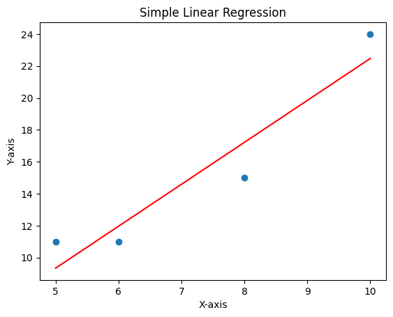

# Simple Linear Regression

This code is an implementation of **Simple Linear Regression** function in **Python** without using **Library Functions**.

This is mainly achieved by the implementation of a mathematical formula for calculating *slope* and *intercept* directly.

### Formula Code Implementation:

```
#Calculate b1(or slope) and b0(or intercept)
b1 = (n*xy_sum - x_sum*y_sum)/(n*x_squared_sum - x_sum**2)
b0 = (y_sum-b1*x_sum)/n
```

### Data Used:
```
x = [5,6,8,10]
y = [11,11,15,24]
```
### Final Graph:
